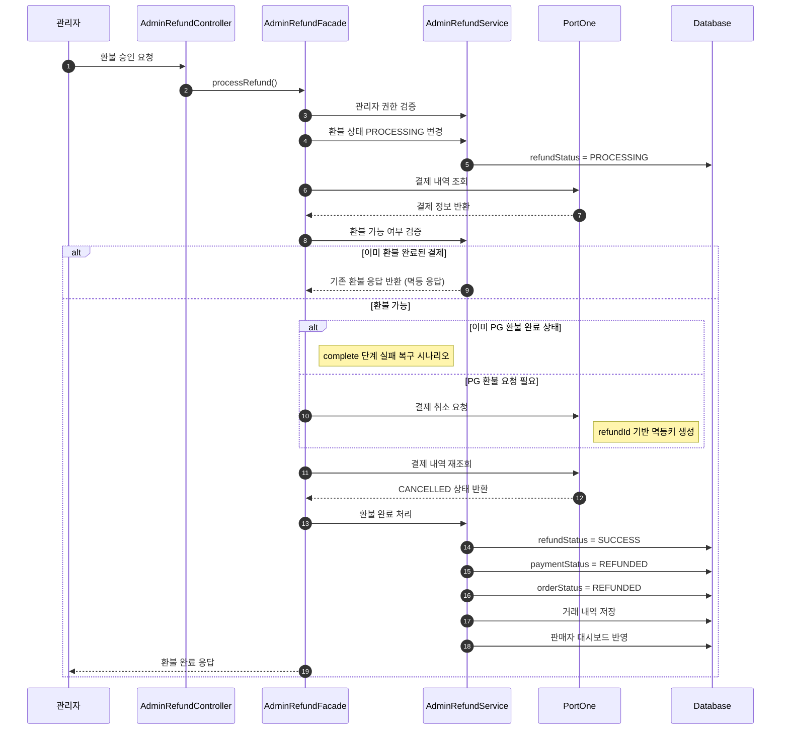
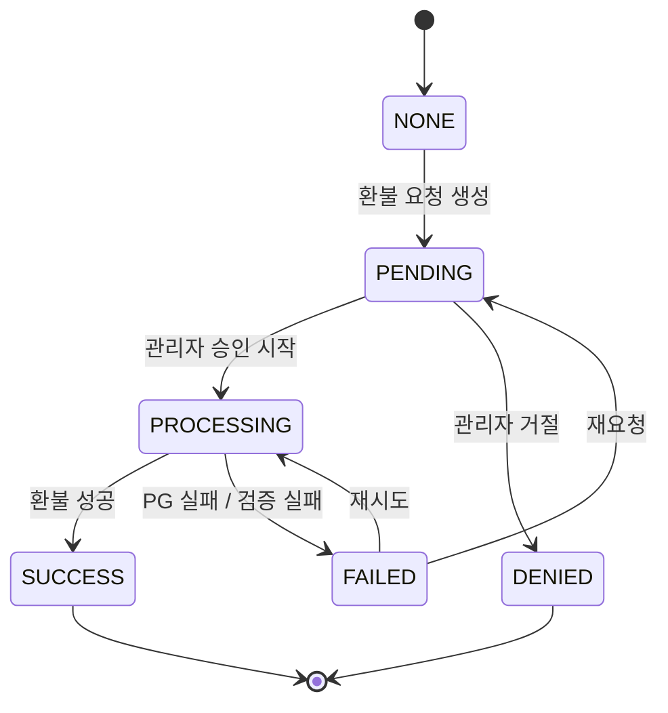
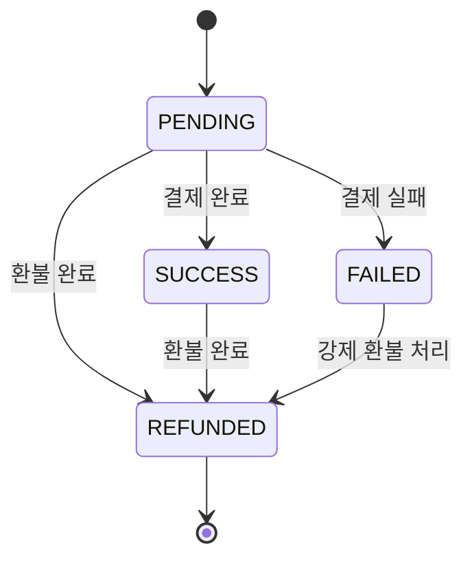
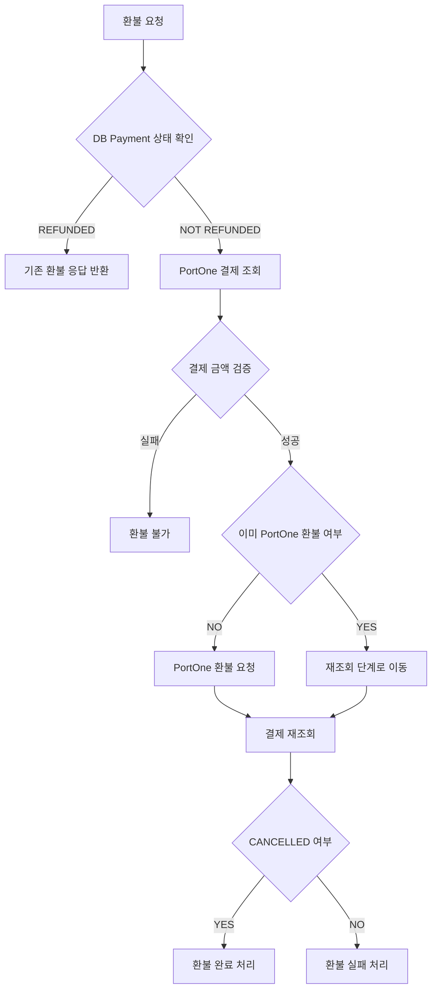
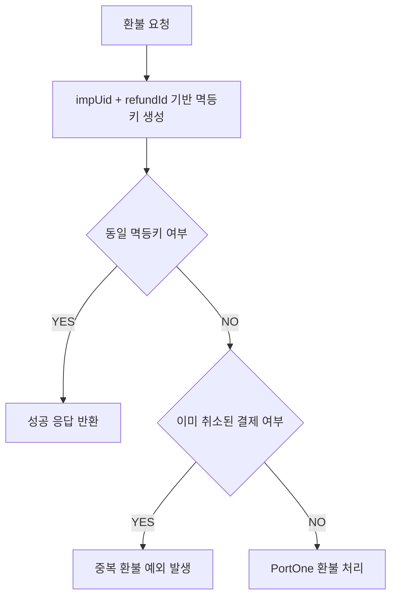
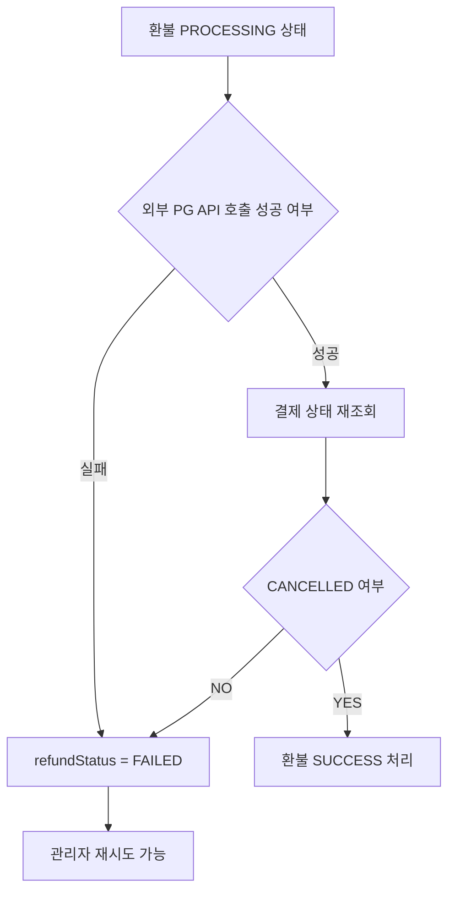
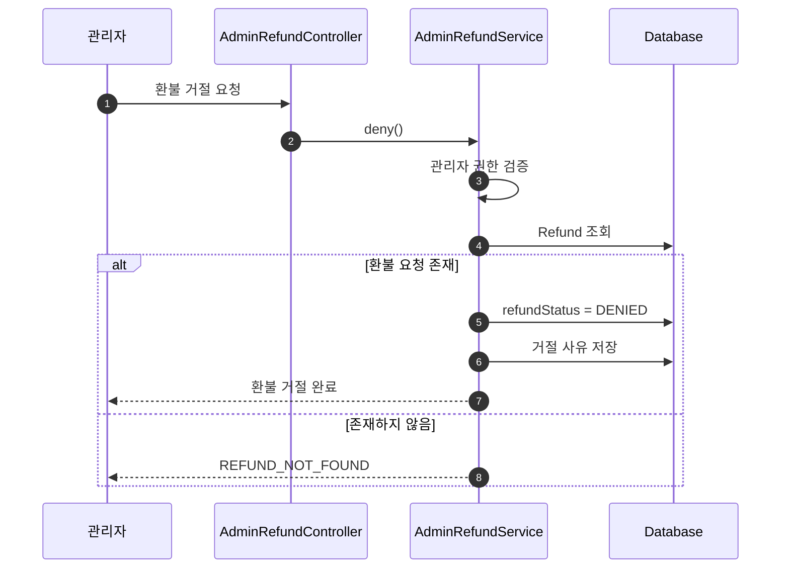
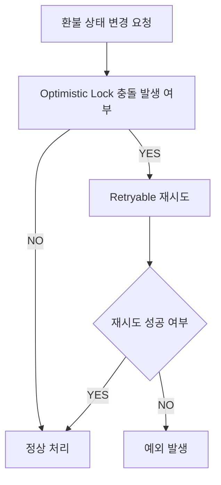
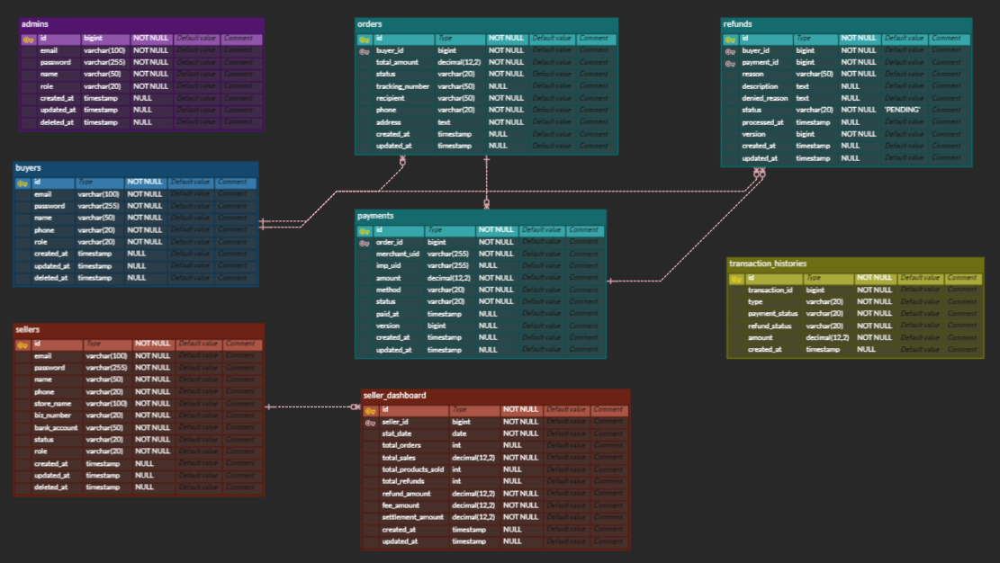

# 🖥️ 관리자 서버

<br>

---

# 1. 📌 서버 개요

## 서버 소개

판매자 승인 및 환불 승인 등 관리자 전용 API 서버

<br>

---

# 2. 📡 주요 API

| Method | URI                                | Description     | Role  |
|--------|------------------------------------|-----------------|-------|
| GET    | /admin/refunds                     | 환불 신청 전체 조회 API | ADMIN |
| PUT    | /admin/refunds/{refundId}/deny     | 환불 신청 반려 API    | ADMIN |
| PUT    | /admin/refunds/{refundId}/complete | 환불 신청 승인 API    | ADMIN |
| PUT    | /admin/sellers/{sellerId}/status   | 판매자 승인 API      | ADMIN |

<br>

---

# 3. 🔄 서비스 플로우

# 관리자 환불 승인 플로우



<br>

---

# 환불 상태 흐름



<br>

---

# 결제 상태 흐름



<br>

---

# 환불 멱등성 처리 플로우



<br>

---

# PortOne 환불 멱등성 전략



<br>

---

# 환불 실패 복구 전략



<br>

---

# 관리자 환불 거절 플로우



<br>

---

# Retry + 동시성 처리 전략



<br>

---

# 4. 🗂️ ERD





<br>

---

# 5. 🚨 트러블 슈팅

## Hibernate 방언(Dialect) 불일치로 인한 테스트 데이터베이스 테이블 생성 실패

### 문제

- 현상: AdminRefundOptimisticLockServiceTest 클래스의 모든 테스트(11개)가 실패하며 Table 'testdb.admins' doesn't exist 오류가 발생합니다.

- 영향: 테스트 실행 시 초기 데이터를 저장하는 setUp() 단계에서 테이블을 찾지 못해 테스트가 시작되지 못하고 전체 중단됩니다.

### 원인

- 방언(Dialect) 설정의 불일치: application.yaml에는 Hibernate 방언이 PostgreSQLDialect로 하드코딩되어 있으나, 테스트 환경에서는 TestContainer를 통해 MySQL을 사용하고 있었습니다.

- DDL 생성 오류: MySQL 데이터베이스에 대해 PostgreSQL 문법으로 DDL(테이블 생성 등)을 수행하려고 시도했으나, MySQL 엔진이 이를 해석하지 못해 테이블 생성 자체가 무산되었습니다.

- 오버라이드 누락: @DynamicPropertySource를 통해 DataSource URL과 계정 정보는 MySQL로 교체했지만, JPA의 핵심 설정인 hibernate.dialect를 함께 교체하지 않아 발생한 문제입니다.

### 해결

테스트 코드 내 @DynamicPropertySource 설정에서 Hibernate 방언을 MySQL에 맞게 강제로 오버라이드하도록 한 줄을 추가했습니다.

```java
@DynamicPropertySource
static void overrideProperties(DynamicPropertyRegistry registry) {
// MySQL TestContainer 정보 등록
registry.add("spring.datasource.url", container::getJdbcUrl);
registry.add("spring.datasource.username", container::getUsername);
registry.add("spring.datasource.password", container::getPassword);

    // 핵심 해결 방안: Hibernate 방언을 MySQL용으로 명시적 지정
    registry.add("spring.jpa.properties.hibernate.dialect", () -> "org.hibernate.dialect.MySQLDialect");
}
```

### 결과

- Hibernate가 MySQL 문법에 맞는 정상적인 DDL을 생성하여 admins 테이블이 정상적으로 생성되었습니다.

- setUp() 과정에서 데이터 저장이 성공적으로 이루어졌으며, 실패하던 11개의 테스트 케이스가 모두 통과되었습니다.

<br>

---

## 로컬 통과, CI 환경에서만 발생하는 JWT Secret 관련 테스트 실패 해결

### 문제

- 현상: 로컬 개발 환경에서는 모든 테스트가 통과하지만, CI(GitHub Actions 등) 환경에서만 AdminRefundOptimisticLock 관련 테스트 16개가 지속적으로 실패합니다.

- 영향: CI 파이프라인이 중단되어 코드 통합 및 배포가 불가능해지며, 개발 프로세스 전반에 병목이 발생합니다.

### 원인

- 프로퍼티 우선순위 충돌: Spring Boot의 설정 우선순위상 시스템 환경변수가 application-test.yml보다 높습니다. CI 서버에 설정된 JWT_SECRET 환경변수가 테스트용 설정값을 덮어쓰면서 문제가 발생했습니다.

- 보안 규격 미달: CI에 설정된 test-jwt-secret-key 혹은 기존 테스트용 시크릿 값이 JJWT 라이브러리(0.10.0 이상)에서 요구하는 최소 길이(HS256 기준 256비트/32바이트)를 충족하지 못했습니다.

- 인코딩 오류: 시크릿 값이 올바른 Base64 형식이 아니어서 io.jsonwebtoken.io.DecodingException이 발생, JwtProvider 빈(Bean) 생성 단계에서 애플리케이션 컨텍스트 로딩이 실패했습니다.

### 해결

환경변수 의존성을 제거하고 테스트 환경 전용의 규격화된 시크릿 키를 명시적으로 설정했습니다.

1. CI 환경변수 제거: CI 설정 파일(workflow.yml 등)에서 JWT_SECRET 환경변수를 제거하여 application-test.yml의 설정이 온전히 적용되도록 수정했습니다.

2. 규격에 맞는 키 생성: HS256 알고리즘을 안전하게 지원할 수 있도록 32바이트 이상의 충분한 길이를 가진 임의의 문자열을 생성했습니다.

3. Base64 인코딩 적용: 생성된 키를 Base64로 인코딩하여 application-test.yml에 고정값으로 주입함으로써, 환경에 구애받지 않는 독립적인 테스트 환경을 구축했습니다.

```yml
# application-test.yml 예시
jwt:
  secret: VtHcoEqCTwJ981b7wHL5yb57mwhlE8UjzYhFu3vd5M1... # 32바이트 이상의 Base64 인코딩된 키
```

### 결과

- JwtProvider 초기화 시 발생하던 DecodingException이 해결되었습니다.

- 로컬과 CI 환경 간의 설정 불일치가 해소되어, 실패하던 16개의 테스트 케이스를 포함한 모든 테스트가 CI에서 정상적으로 통과되었습니다.

- 환경변수에 의존하지 않는 테스트 설정을 통해 테스트의 재현성과 독립성을 확보했습니다.

<br>

---